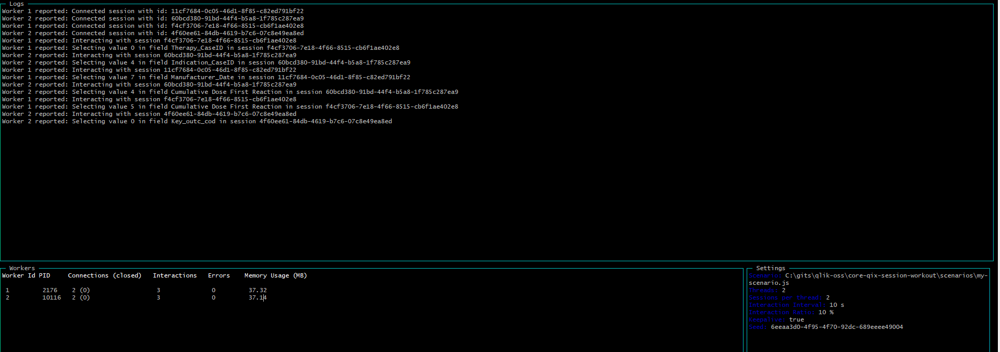

# core-qix-session-workout

[](https://circleci.com/gh/qlik-oss/core-qix-session-workout)

Generic load test tool for Qlik Core.

This is an experimental tool and its APIs is under redesign.



## Usage

```code
Usage: main.js [options]

Options:
  --help, -h             Show help                                                                                                 [boolean]
  --threads, -t          Number of threads to run in parallell
                         Setting to `-1` will use the number of cores                                                  [number] [default: 1]
  --max, -m              Max number of sessions                                                                                     [number]
  --interval, -i         How often new sessions should be created                                                     [number] [default: 60]
  --interactionInterval  How often interactions should be done                                                     [number] [default: 10000]
  --interactionRatio     The amount of sessions the should do selections (in %)                                      [number] [default: 0.1]
  --exit                 Exit main process after all worker threads has finished                                  [boolean] [default: false]
  --config, -c           Path to JSON config file                                                                                   [string]
  --scenario, -s         Path to scenario file                                                                           [string] [required]
  --sessionLength        The length of each session (in ms)                                                   [number] [default: 1000000000]
  --triangular           If set to true the traffic speed will slowly increase to the
                         maximum rate (the specified interval) and thereafter slowly decrease                     [boolean] [default: false]
  --seed                 The seed that should be used for generating randomness                                                     [string]
```

Program arguments are defined in this order of precedence:

- Command line args
- Env vars
- Config file/objects
- Configured defaults

## Config files

Configurations can be specified in a config file and be passed as a parameter to `main.js` as in example below:

```bash
node main.js -c configs/direct-local.json -s scenarios/random-selection-scenario.js
```

## Scenarios

A scenario implements the actions that should be performed for each session. For example, connecting and interacting
with the session.

The tool takes a `scenario` as a parameter either by using the `-s` or `--scenario` flag. The scenario can also be added
as a property to the `config` file if the configuration is specific to the scenario.

A basic example of how a scenario can be implemented is available in [random-selection-scenario.js](./scenarios/random-selection-scenario.js).
The scenario uses enigma.js to communicate with the Qlik Associative Engine.

There are three methods that are needed in a scenario implementation to be executable with this tool:

- `init(configuration, getRandomNumber, log)` - Method for initializing the scenario i.e. setting the config file and
  method for passing logs to the runner. Since the config is passed to the scenario it can also be reused for scenario
  parameters that are shared between different scenarios e.g. headers or gateway URL.
- `connect(sessionId)` - Method for connecting the session to a Qlik Associative Engine instance.
  A random sessionId is passed to guarantee unique sessions. This method should return a qix object.
- `interact(qix)` - Depending on configuration e.g. **interactionInterval** the scenario will be trigged with a certain
  interval to perform an interaction. It is up to the scenario to define what interaction that should be made e.g.
  making a selection, creating objects etc.

## Seeding

The tool will use a seed to generate random numbers used for interactions and intervals when triggering a scenario.
If a seed is not specified as a parameter to the tool or in the config file, then a seed will be generated for each run.
The seed will be shown in the UI of the tool to make it possible to rerun the exact same scenario again.
